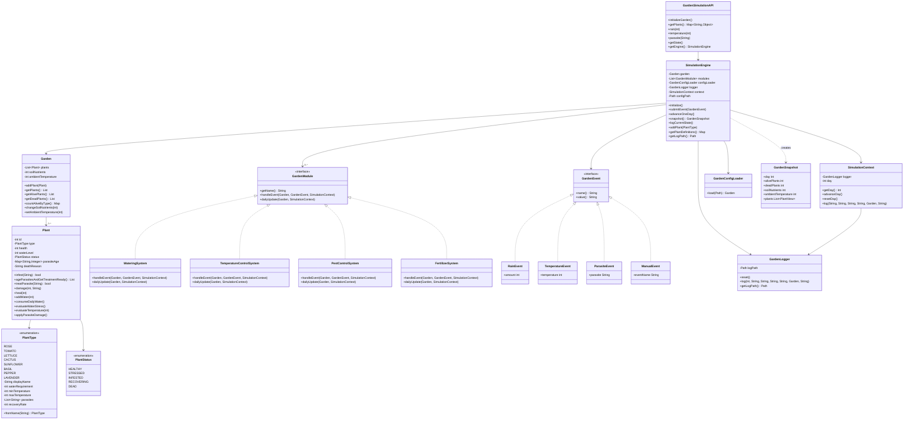
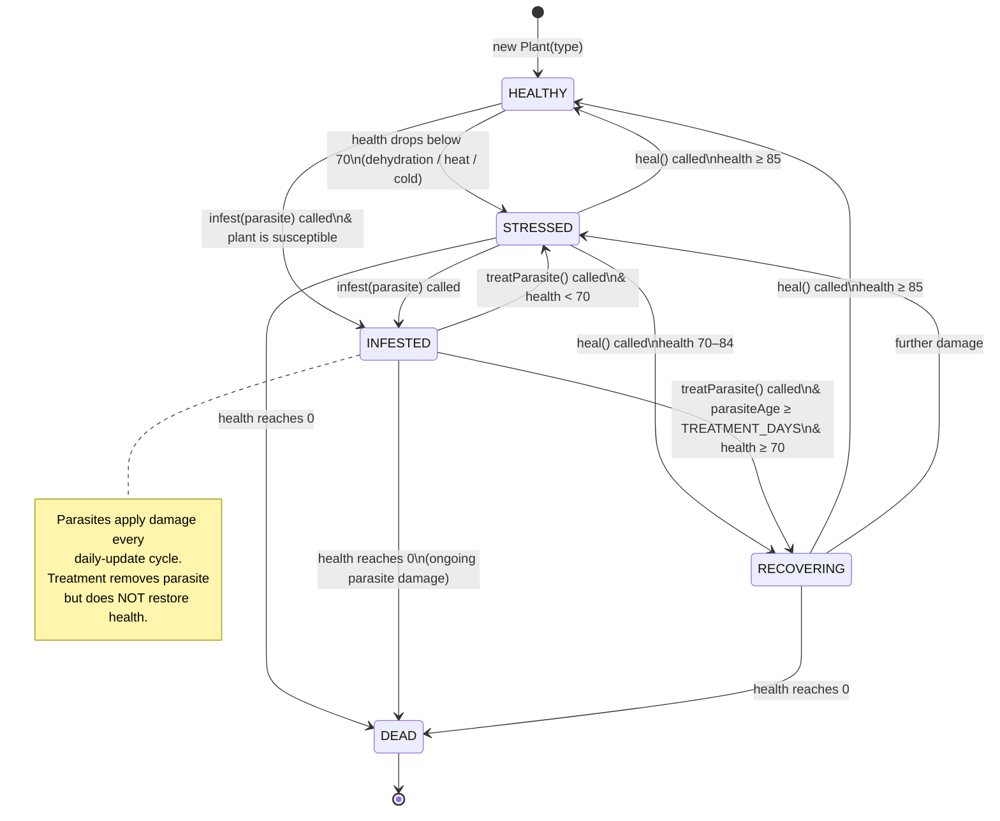
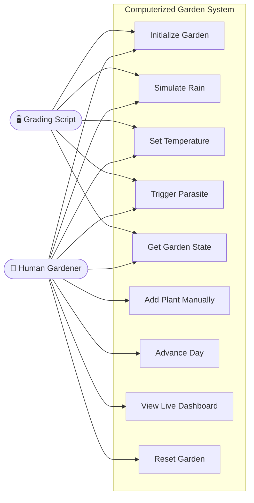
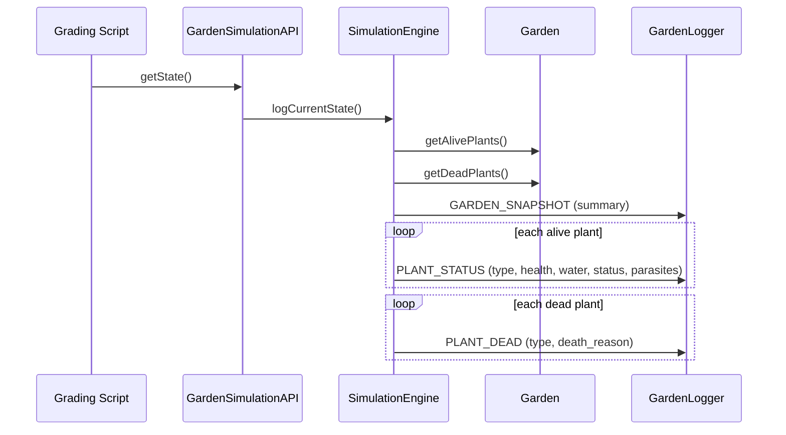

# UML Diagrams

---

## 1. Class Diagram



---

## 2. Plant State Diagram

Tracks the lifecycle of every `Plant` object from birth to death.



---

## 3. Use Case Diagram



---

## 4. Sequence Diagram — Event Processing

```mermaid
sequenceDiagram
    participant Script as Grading Script / UI
    participant API as GardenSimulationAPI
    participant Engine as SimulationEngine
    participant Modules as GardenModule(s)
    participant Garden as Garden / Plants
    participant Log as GardenLogger

    Script->>API: rain(25) / temperature(95) / parasite("aphid")
    API->>Engine: submitEvent(event)
    Engine->>Log: EVENT_RECEIVED (day N)

    loop handleEvent — each module
        Engine->>Modules: handleEvent(garden, event, ctx)
        Modules->>Garden: update plant/env state
        Modules->>Log: module-specific action log
    end

    loop dailyUpdate — each module
        Engine->>Modules: dailyUpdate(garden, ctx)
        Modules->>Garden: aging, treatment, irrigation, fertilizer
        Modules->>Log: daily module summary
    end

    Engine->>Garden: evaluateWaterStress(); consumeDailyWater()
    Engine->>Log: DAY_COMPLETED (alive/dead counts)
```

---

## 5. Sequence Diagram — getState()


