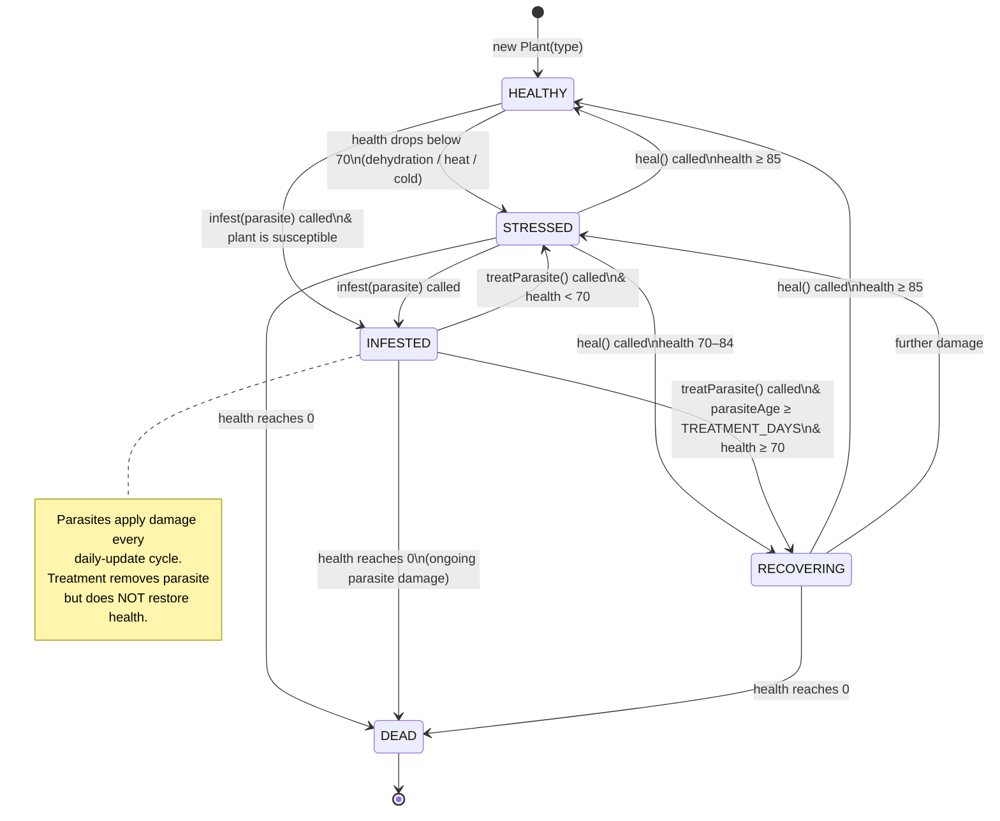
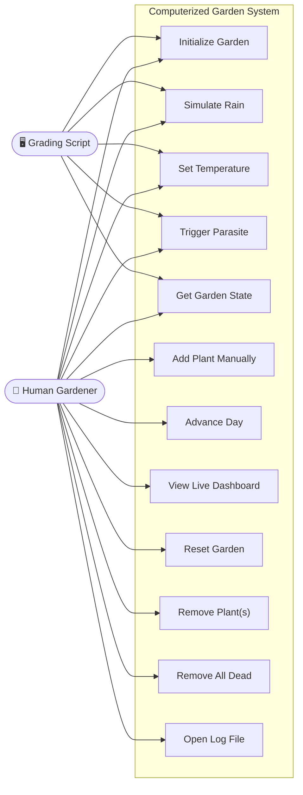
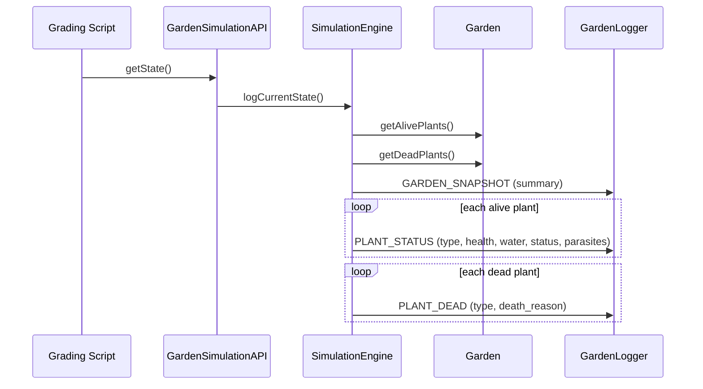
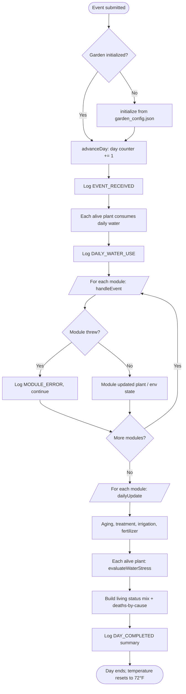
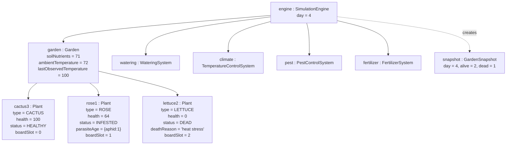
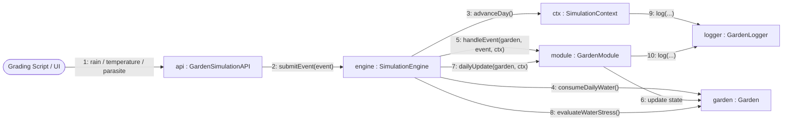

# UML Diagrams

---

## 1. Class Diagram

```mermaid
classDiagram
    class GardenSimulationAPI {
        +initializeGarden()
        +getPlants() Map~String,Object~
        +rain(int)
        +temperature(int)
        +parasite(String)
        +getState()
        +getEngine() SimulationEngine
    }

    class SimulationEngine {
        -Garden garden
        -List~GardenModule~ modules
        -GardenConfigLoader configLoader
        -GardenLogger logger
        -SimulationContext context
        -Path configPath
        +initialize()
        +initializeWith(Map~PlantType,Integer~)
        +submitEvent(GardenEvent)
        +advanceOneDay()
        +tickAutonomous()
        +snapshot() GardenSnapshot
        +logCurrentState()
        +addPlant(PlantType)
        +removePlant(String) bool
        +removeDeadPlants() int
        +getPlantDefinitions() Map
        +getRecentLogEntries() List
        +getRecentUserLogEntries() List
        +getLogPath() Path
    }

    class SimulationContext {
        -GardenLogger logger
        -int day
        +getDay() int
        +advanceDay()
        +resetDay()
        +log(String, String, String, String, Garden, String)
    }

    class Garden {
        -List~Plant~ plants
        -int soilNutrients
        -int ambientTemperature
        -int lastObservedTemperature
        -int lastEventRawTemperature
        +addPlant(Plant)
        +removePlant(Plant) bool
        +removePlantByName(String) bool
        +getPlants() List
        +getAlivePlants() List
        +getDeadPlants() List
        +countAliveByType() Map
        +changeSoilNutrients(int)
        +setAmbientTemperature(int)
        +getLastObservedTemperature() int
        +getLastEventRawTemperature() int
    }

    class Plant {
        -int id
        -PlantType type
        -int health
        -int waterLevel
        -PlantStatus status
        -Map~String,Integer~ parasiteAge
        -String deathReason
        -int boardSlot
        +getBoardSlot() int
        +setBoardSlot(int)
        +infest(String) bool
        +ageParasitesAndGetTreatmentReady() List
        +treatParasite(String) bool
        +damage(int, String)
        +heal(int)
        +addWater(int)
        +consumeDailyWater()
        +evaluateWaterStress()
        +evaluateTemperature(int)
        +applyParasiteDamage()
    }

    class PlantType {
        <<enumeration>>
        ROSE
        TOMATO
        LETTUCE
        CACTUS
        SUNFLOWER
        BASIL
        PEPPER
        LAVENDER
        -String displayName
        -int waterRequirement
        -int minTemperature
        -int maxTemperature
        -List~String~ parasites
        -int recoveryRate
        +fromName(String) PlantType
    }

    class PlantStatus {
        <<enumeration>>
        HEALTHY
        STRESSED
        INFESTED
        RECOVERING
        DEAD
    }

    class GardenModule {
        <<interface>>
        +getName() String
        +handleEvent(Garden, GardenEvent, SimulationContext)
        +dailyUpdate(Garden, SimulationContext)
    }

    class WateringSystem {
        +handleEvent(Garden, GardenEvent, SimulationContext)
        +dailyUpdate(Garden, SimulationContext)
    }
    class TemperatureControlSystem {
        +handleEvent(Garden, GardenEvent, SimulationContext)
        +dailyUpdate(Garden, SimulationContext)
    }
    class PestControlSystem {
        +handleEvent(Garden, GardenEvent, SimulationContext)
        +dailyUpdate(Garden, SimulationContext)
    }
    class FertilizerSystem {
        +handleEvent(Garden, GardenEvent, SimulationContext)
        +dailyUpdate(Garden, SimulationContext)
    }

    class GardenEvent {
        <<interface>>
        +name() String
        +value() String
    }
    class RainEvent { +amount int }
    class TemperatureEvent { +temperature int }
    class ParasiteEvent { +parasite String }
    class ManualEvent { +eventName String }

    class GardenLogger {
        -Path logPath
        +reset()
        +log(int, String, String, String, String, Garden, String)
        +recentEntries() List~LogEntry~
        +recentUserEntries() List~LogEntry~
        +getLogPath() Path
    }

    class GardenConfigLoader {
        +load(Path) Garden
    }

    class GardenSnapshot {
        +day int
        +alivePlants int
        +deadPlants int
        +soilNutrients int
        +ambientTemperature int
        +outsideTemperature int
        +plants List~PlantView~
    }

    class PlantView {
        +name String
        +type String
        +health int
        +waterLevel int
        +status String
        +activeParasites String
        +deathReason String
        +slotIndex int
    }

    GardenSimulationAPI --> SimulationEngine
    SimulationEngine --> Garden
    SimulationEngine --> GardenLogger
    SimulationEngine --> SimulationContext
    SimulationEngine --> GardenConfigLoader
    SimulationEngine --> "0..*" GardenModule
    SimulationEngine --> GardenEvent
    SimulationContext --> GardenLogger
    Garden --> "0..*" Plant
    Plant --> PlantType
    Plant --> PlantStatus
    GardenModule <|.. WateringSystem
    GardenModule <|.. TemperatureControlSystem
    GardenModule <|.. PestControlSystem
    GardenModule <|.. FertilizerSystem
    GardenEvent <|.. RainEvent
    GardenEvent <|.. TemperatureEvent
    GardenEvent <|.. ParasiteEvent
    GardenEvent <|.. ManualEvent
    SimulationEngine ..> GardenSnapshot : creates
    GardenSnapshot --> "0..*" PlantView
```



---

## 2. Plant State Diagram

Tracks the lifecycle of every `Plant` object from birth to death.



---

## 3. Use Case Diagram



---

## 4. Sequence Diagram — Event Processing

```mermaid
sequenceDiagram
    participant Script as Grading Script / UI
    participant API as GardenSimulationAPI
    participant Engine as SimulationEngine
    participant Modules as GardenModule(s)
    participant Garden as Garden / Plants
    participant Log as GardenLogger

    Script->>API: rain(25) / temperature(95) / parasite("aphid")
    API->>Engine: submitEvent(event)
    Engine->>Log: EVENT_RECEIVED (day N)

    loop handleEvent — each module
        Engine->>Modules: handleEvent(garden, event, ctx)
        Modules->>Garden: update plant/env state
        Modules->>Log: module-specific action log
    end

    loop dailyUpdate — each module
        Engine->>Modules: dailyUpdate(garden, ctx)
        Modules->>Garden: aging, treatment, irrigation, fertilizer
        Modules->>Log: daily module summary
    end

    Engine->>Garden: evaluateWaterStress(); consumeDailyWater()
    Engine->>Log: DAY_COMPLETED (alive/dead counts)
```

---

## 5. Sequence Diagram — getState()



---

## 6. Activity Diagram — Daily Simulation Cycle

The control flow of a single `submitEvent(...)` call — the heart of every simulated day,
whether triggered by an API call, a manual "Advance Day" click, or the autonomous timer.



---

## 7. Object Diagram — Runtime Snapshot

A concrete instant on day 4: one healthy Cactus, one infested Rose mid-treatment, and one
dead Lettuce whose board slot has been freed. Illustrates the live object graph the engine
holds and the immutable `GardenSnapshot` the UI renders from.



---

## 8. Communication Diagram — Event Processing

The same interaction as the event-processing sequence diagram, drawn as a communication
(collaboration) diagram to emphasize object links and the numbered message order.


